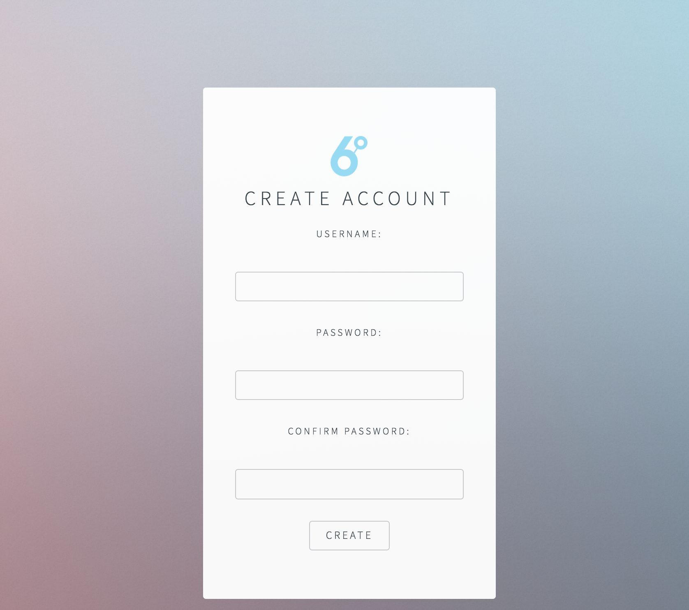
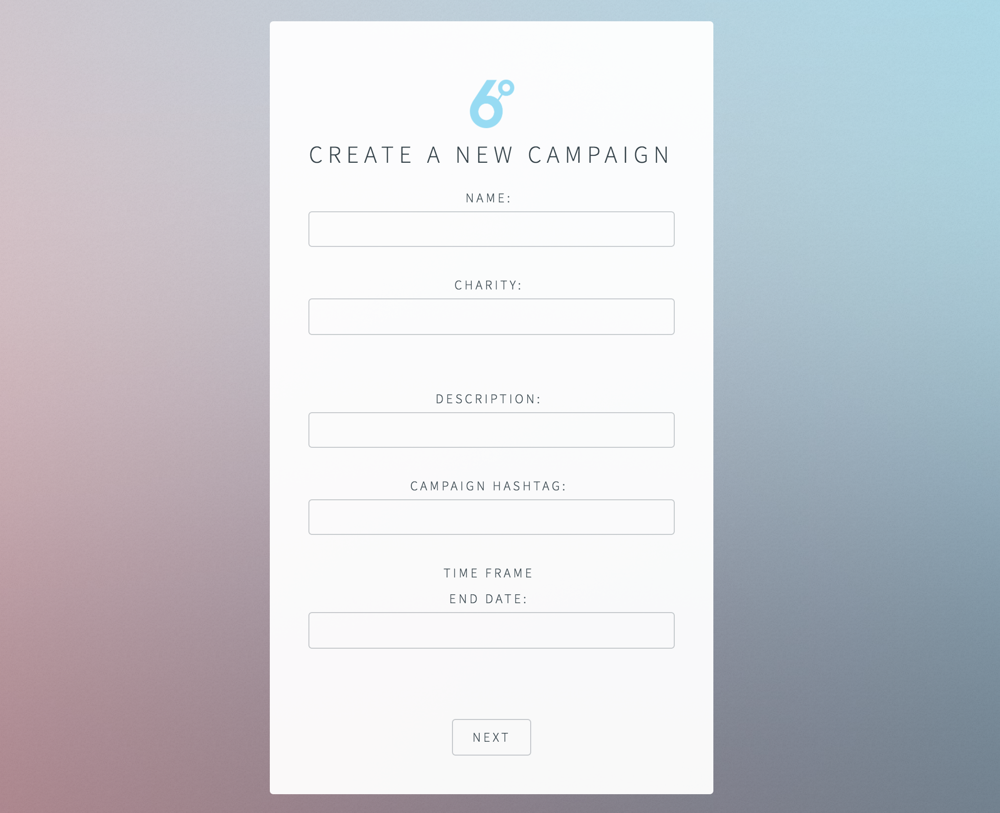
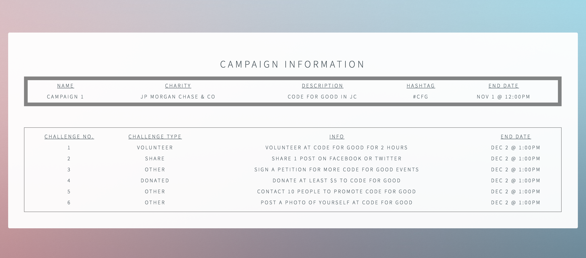
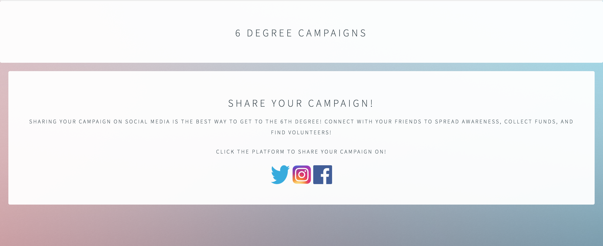

### Six Degrees
A Prototype for Kevin Bacon's Six Degrees Idea developed during the Code For Good Hackathon.

### Goal:

To create a web application that connects, informs, and motivates 6 Degrees users so that they become more involved in local nonprofits.

### What is this application about?

This web application gives 6 Degrees users a new experience. It integrates the concepts of social networking and local impact, both were essential to 6 Degrees requirements. This application contains new and easy to use webpages that allow the user to do several things. Users can start their own campaigns, create their own challenges, and have several opportunities to contribute to local nonprofits through sharing a post on social media, donating money, and volunteering at an event.

### From a business perspective:

A web application with this goal creates a local impact within events, rewards people for sharing, donating, and volunteering, and makes the “6 Degrees” name more known as a platform. All of these attributes benefit 6 Degrees.

### How does it work?

A user goes to the home screen and enters their login credentials. Afterward successful sign in, the user gets taken to their dashboard where they can view current challenges from campaigns they joined, campaign invites from other catalysts, and current campaigns. Clicking on a campaign will take the user to a public dashboard of the campaign itself, where reports are given by creating aggregations from the database.
The user also has the ability to create a new campaign. The page they are directed to create a new campaign is two-fold. The first page asks about the name and info about campaign. Once they click submit, this creates an entry in the database with default challenges provided from the submit function. From there, the user can edit those challenges or remove as they please.

### Screenshots

***

### Team Members
**DanDan Lin**  
CUNY Hunter College 
dandanlin.l@gmail.com  
https://github.com/Dandanlin0702

**Olga Kent**  
CUNY Hunter College  
olgakent.ok@gmail.com  
https://github.com/olgakent  
